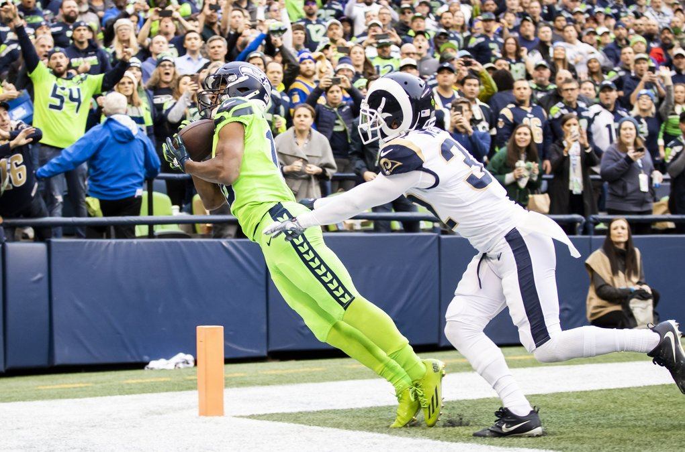

# Back and Forth Game, but Seattle Seahawks with MVP Candidate Russell Wilson Prevailed

In the beginning of the game, the _Los Angeles Rams_ had a strong start to the game, leading 6-0. With two beautiful throw from **Russell Wilson**, the _Seattle Seahawks_ came back to take the lead 14-13 going the half. Through crazy bounces, interceptions, miss kicks, and a frantic finish, the _Seattle Seahawks_ and **Russell Wilson** sent a deafening statement across the _NFL_. In this [article](https://www.cbssports.com/nfl/news/pete-carroll-says-russell-wilson-is-off-to-his-best-start-ever-for-3-1-seahawks/), Pete Carroll states why Russell Wilson should be in the MVP Conversation.

> I think he's off to his best start ever. I don't know what it looks like numbers wise, but I think it is. I don't think he's ever been more accurate than he's been, and more consistent, and in command of everything. I think he's off to a great start. I don't care how big the numbers are, I'm not talking about how many yards or whatever, just his play has been really, really sharp.

[The Seattle Times](https://www.seattletimes.com/sports/seahawks/russell-wilson-to-tyler-lockett-touchdown-the-story-of-the-most-improbable-completion-in-recent-nfl-history/) captured this most importable TD pass in recent NFL history from Russell Wilson to Tyler Lockett:

More about this game:
- _NFL_ [Power Rankings](https://www.scout.com/football/nfl/news/nfl-power-ranking-seahawks-move-up-but-rams-still-ahead-of-them-despite-loss/) after the game
- **Greg Zuerlein** [interview](http://www.nfl.com/news/story/0ap3000001061850/article/rams-greg-zuerlein-blames-poor-swing-for-missed-fg) after missing the game winning kick
- **Tedric Thompson** joins candidates for best inception of the year with this juggling [act](https://www.espn.com/blog/seattle-seahawks/post/_/id/33280/tedric-thompsons-acrobatic-int-validates-seahawks-faith)
